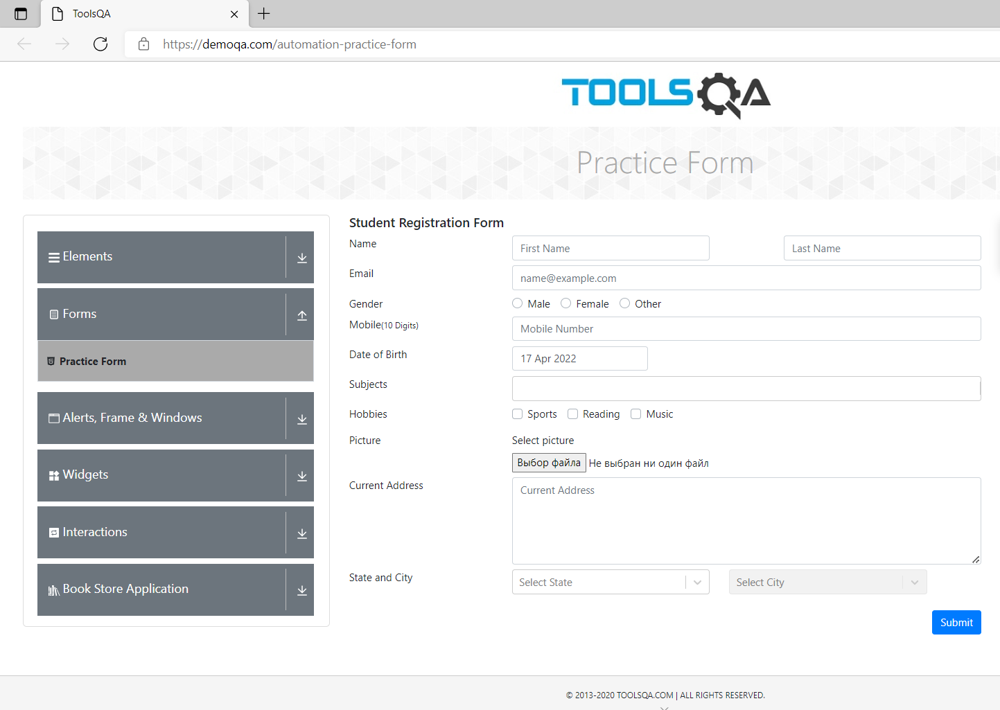
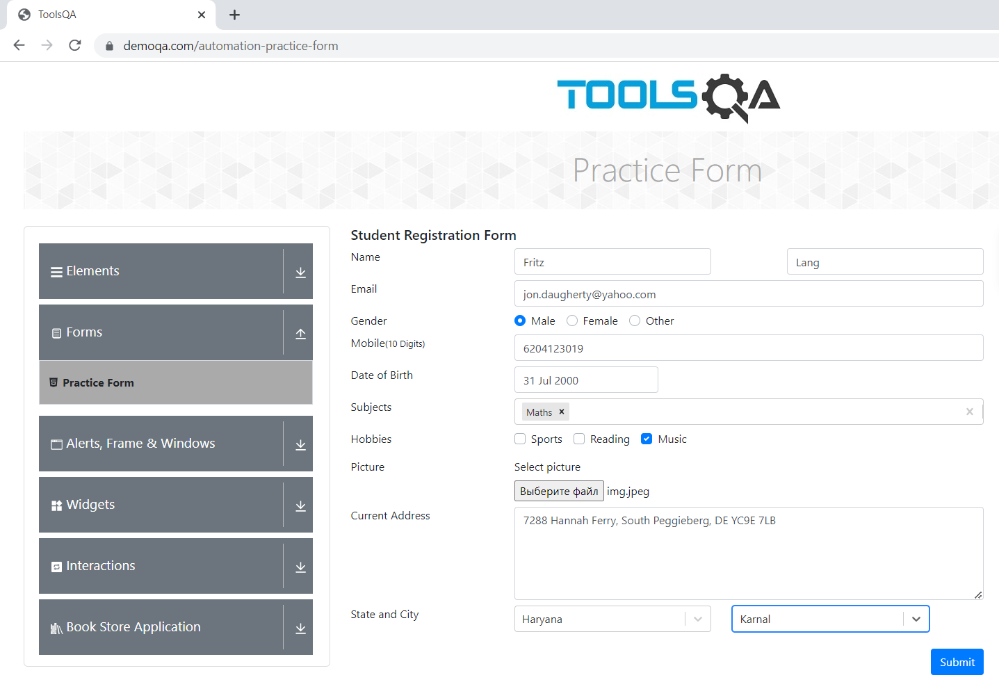
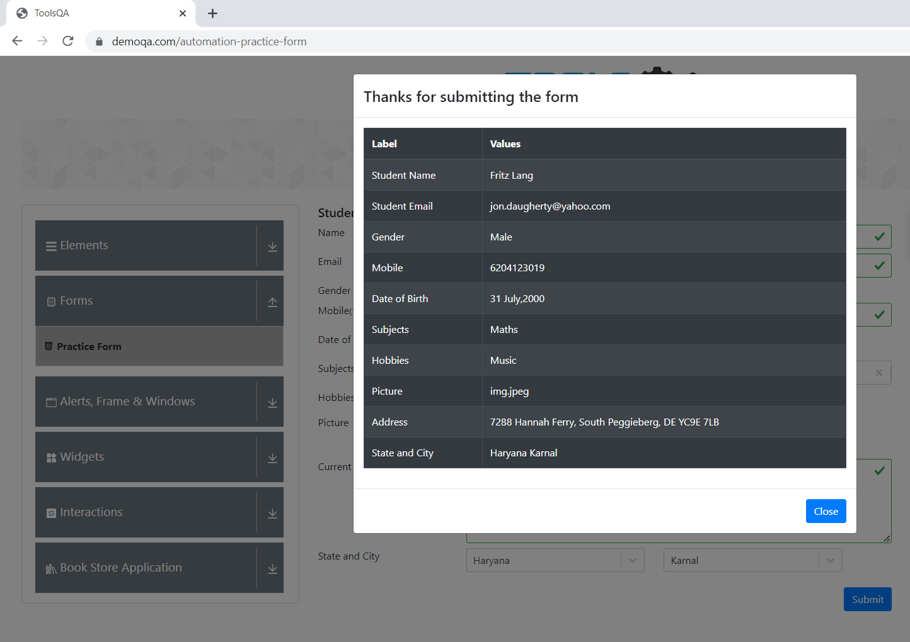

# QA.GURU School
## Lesson 3. Page Object

In this repo we have 1 autotest to check [this](https://demoqa.com/automation-practice-form) registration form. 

Test data are generated via Java Faker for each test run 

Test do 2 steps in serial. First, fill the fields. 

Second, obtain data from DOM and compare with those sent on previous step

After that press Close button.
